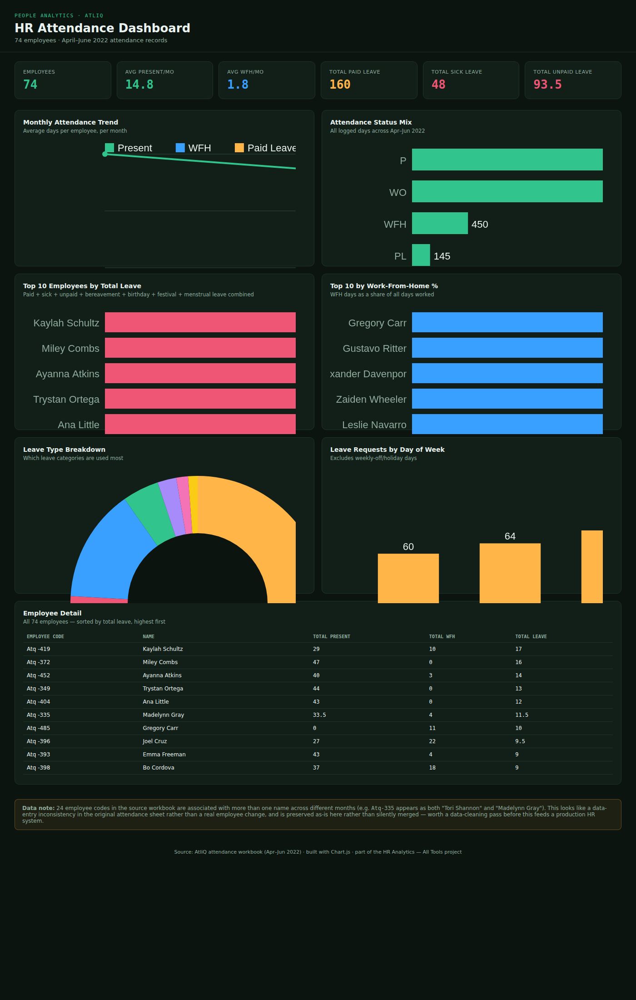

# HR Analytics — Employee Attendance Dashboard (AtliQ)

An end-to-end HR attendance analytics project analyzing real employee
attendance data from a company called **AtliQ**, covering April–June 2022
across 74 employees. The same underlying data is analyzed five different
ways — SQL, Python, Excel, Power BI, and Tableau — plus a standalone
interactive web dashboard.





## Project description

HR and people-ops teams need visibility into attendance and leave patterns
to plan workforce capacity, spot burnout risk, and catch disengagement
early. This project answers:

- Who is present, on leave, or working from home, and how does that shift month to month?
- Which employees are taking the most leave, and of what type?
- Are there day-of-week patterns in leave requests?
- Is attendance trending up or down over the quarter?

**Headline numbers:**

| Metric | Value |
|---|---|
| Employees tracked | 74 |
| Months covered | April, May, June 2022 |
| Avg days present / employee / month | 14.8 |
| Avg WFH days / employee / month | 1.8 |
| Total paid leave logged | 160 days |
| Total sick leave logged | 48 days |
| Total unpaid leave (LWP) logged | 93.5 days |

## Technology used

| Layer | Tool |
|---|---|
| Data cleaning & consolidation | Python (pandas) |
| Exploratory analysis | Python (pandas, matplotlib, seaborn) |
| Querying | SQL (SQLite-tested, ANSI-compatible) |
| Reporting workbook | Excel (openpyxl, live formulas) |
| BI dashboard | Power BI (Power Query M, DAX) |
| BI dashboard (alt) | Tableau (calculated fields) |
| Web dashboard | HTML + Chart.js |

## Project structure
hr-analytics-attendance/
├── data/          source workbook + cleaned CSVs
├── sql/           SQL analysis queries
├── python/        data cleaning + EDA scripts
├── excel/         KPI workbook with live formulas
├── powerbi/       real .pbix report + DAX reference
├── tableau/       calculated fields + build guide
├── dashboard/     standalone interactive HTML dashboard
├── images/        charts exported from Python EDA
├── screenshots/   dashboard preview image
└── README.md

## How to use this project

**View the dashboard instantly (no setup)**
Download `dashboard/hr_dashboard.html` and open it in any browser — no
installation required.

**Run the Python analysis**
```bash
git clone https://github.com/aastha1534/HR-Analytics-Attendance.git
cd HR-Analytics-Attendance
pip install -r python/requirements.txt
python python/consolidate_attendance.py
python python/eda_attendance.py

Query the data with SQL
Load data/attendance_monthly.csv and data/attendance_daily.csv into
SQLite (or any SQL database) and run the queries in
sql/hr_attendance_queries.sql.
Open the Excel workbook
Open excel/HR_Attendance_Analysis.xlsx directly — the Dashboard sheet
recalculates automatically from the RawData sheet.
Open the Power BI report
Open powerbi/HR-Analytics-Atliq.pbix in Power BI Desktop — it's a fully
built, working report.
Rebuild in Tableau
Follow tableau/README.md — includes every calculated field and a
sheet-by-sheet build guide.

Key insights
Attendance dropped over the quarter: average days present per
employee fell from 17.8 (April) to 16.4 (May) to 10.4 (June).
WFH held steady at roughly 1.7–2.0 days/employee/month across all
three months.

Leave is concentrated in a small group — the top 10 leave-takers
account for a disproportionate share of total leave days.

A handful of employees work from home almost exclusively.
Leave requests cluster around certain weekdays — a pattern worth
watching for approval-policy implications.
Data quality note


